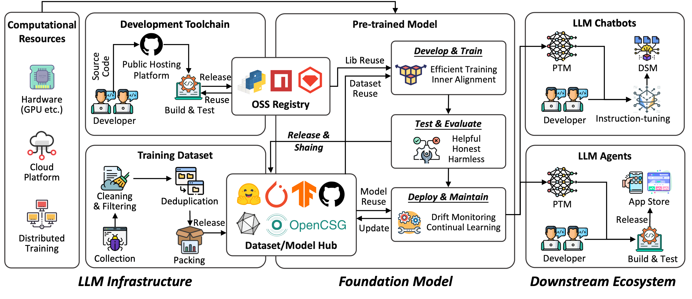

---
# Feel free to add content and custom Front Matter to this file.
# To modify the layout, see https://jekyllrb.com/docs/themes/#overriding-theme-defaults

permalink: /
title: Home
layout: home
---

## **The 1st Workshop on Large Language Model Supply Chain Analysis (LLMSC)**
<!-- 
<a href="https://eccv2024.ecva.net/">The 18th European Conference on Computer Vision 2024 in Milan, Italy</a>

September 30th, 2024
 -->
---

#### 📅 **Workshop Details**

- **Date**: [Insert Date]
- **Location**: [Insert Location or "Virtual Event" if online]
- **Co-located with**: [Insert Event Name] 
- **Twitter**: [Insert URL]  
- **Contact**: [Insert Email Address]

---

Welcome to the **1st Workshop on Large Language Model Supply Chain Analysis (LLMSC)**! This workshop brings together researchers, practitioners, and policymakers to discuss the challenges and opportunities in building and managing the infrastructure and supply chains necessary for large-scale AI models. Large language models (LLMs) and other AI systems are transforming industries, but their complexity raises critical questions about **security, governance, and sustainability**. LLMSC aims to address these questions by fostering collaboration, sharing insights, and promoting responsible practices to navigate this rapidly evolving field.

{: style="width: 75%; height: auto; display: block; margin: 0 auto;" }

The workshop aims to:

- **Discuss infrastructure challenges** in training and deploying large AI models, including resource management, scalability, and reliability.
- **Explore governance frameworks** to ensure transparency, ethical compliance, and accountability in LM supply chains.
- **Share best practices and lessons learned** from diverse industries and organizations deploying large-scale AI solutions.
- **Foster collaboration** between academia, industry, and regulators to address shared challenges and align on best practices for governance.

---

#### 📢 **Call for Papers**

We invite submissions on topics including but not limited to:

- **LM Supply Chain Ecosystem Modeling**
  - Modeling and analysis of open-source model or LM toolchain ecosystemsn
  - Ecosystem evolution analysis over time

- **Best SE Practice for LM Toolchain**
  - Horizontal comparison of large model development tools
  - Developer-centric perspectives on large model toolchains
  - Bug detection and repair for large model development tools
  - Best practices for developing LM-integrated applications

- **Governance of Model Supply Chain Ecosystems**
  - Model provenance and license compliance
  - Standardization in LM supply chain ecosystems

- **Security Analysis of Supply Chain Ecosystems**
  - Vulnerability management in emerging toolchains
  - Threat analysis in LLM-integrated applications
  - Case studies and real-world experiences with LM infrastructure
  - New security paradigms for LM systems

**Submission Guidelines**:

We welcome the following two types of submissions:
- **Position Papers (1-4 pages including references)**: Well-argued position or work in progress.
- **Research Papers (4-8 pages including references)**: Technical research, experience reports, empirical studies, etc.

**Requirements**:

- **All submissions must be original and not under review elsewhere.**
- Submissions must conform to the **[ISSTA Format and Submission Guidelines]()**.
- Papers must be submitted via the **[submission site]()** by **XXX, 2025 (AoE)**.
- The **official publication date** is the date the proceedings are made available in the **ACM Digital Library**. This date may be up to two weeks prior to the first day of the ISSTA conference. The official publication date affects the **deadline for any patent filings** related to published work.

**Review Process**:
- Submissions will be **peer-reviewed by at least three members** of the program committee.
- Evaluation criteria include **originality, relevance, technical soundness, and clarity of presentation**.

**Important Dates**:

- **Paper Submission Deadline**: On Hold
- **Notification of Acceptance**: On Hold
- **Camera-Ready Papers Due**: On Hold

---

#### 👥 **Organizing Committee**



---

#### 👩‍💻👨‍💻 **Program Committee (PC)**



---

#### 💡 **Sponsors and Partners**

Under Invitation

<!--  -->

---

#### 🌐 **Stay Connected**

- **Twitter**: [On Hold]  
- **Mailing List**: [On Hold]  

For any inquiries, please contact us at **[On Hold]**.

---