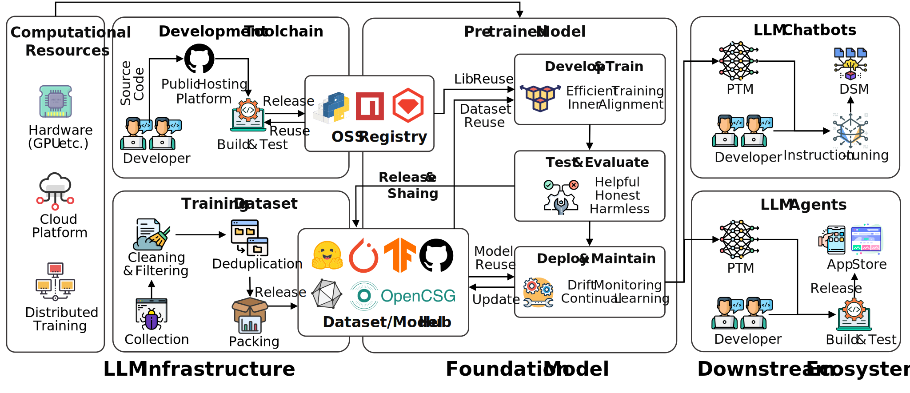

---
# Feel free to add content and custom Front Matter to this file.
# To modify the layout, see https://jekyllrb.com/docs/themes/#overriding-theme-defaults

permalink: /
title: Home
layout: home
---

### The 1st Workshop on Large Model Infrastructure and Supply Chain Governance **(LMISC)**
<!-- 
<a href="https://eccv2024.ecva.net/">The 18th European Conference on Computer Vision 2024 in Milan, Italy</a>

September 30th, 2024
 -->

---

Welcome to the **1st Workshop on Large Model Infrastructure and Supply Chain Governance (LMISC)**! This workshop brings together researchers, practitioners, and policymakers to discuss the challenges and opportunities in building and managing the infrastructure and supply chains necessary for large-scale AI models. Large language models (LLMs) and other AI systems are transforming industries, but their complexity raises critical questions about **security, governance, and sustainability**. LMISC aims to address these questions by fostering collaboration, sharing insights, and promoting responsible practices to navigate this rapidly evolving field.

{: style="width: 75%; height: auto; display: block; margin: 0 auto;" }

The workshop aims to:

- **Discuss infrastructure challenges** in training and deploying large AI models, including resource management, scalability, and reliability.
- **Explore governance frameworks** to ensure transparency, ethical compliance, and accountability in LM supply chains.
- **Share best practices and lessons learned** from diverse industries and organizations deploying large-scale AI solutions.
- **Foster collaboration** between academia, industry, and regulators to address shared challenges and align on best practices for governance.